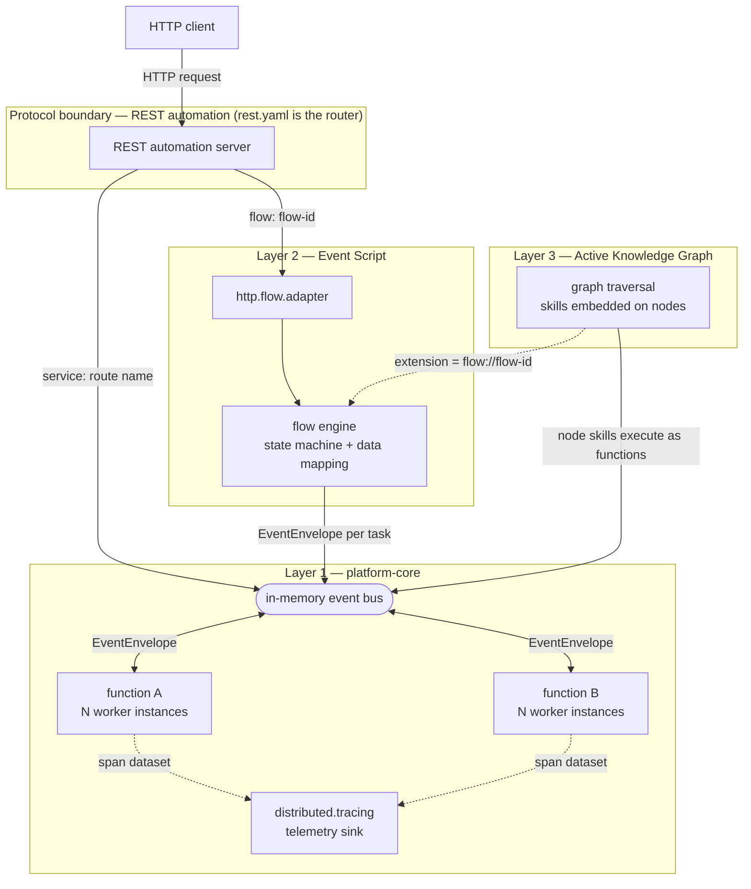

# Architecture Overview

mercury is a Rust framework for building event-driven applications from self-contained,
stateless **functions** wired together by configuration — a faithful port of
[mercury-composable](https://github.com/Accenture/mercury-composable) (Java). Because each
function is a pure input-process-output unit with an explicit contract, the framework also
suits deterministic AI-assisted development: each DSL ships an agent-ready grammar — see the
[function](event-driven/ai-agent-guide.md), [Event Script](event-script/ai-agent-guide.md),
and [knowledge graph](knowledge-graph/ai-agent-guide.md) agent guides. This page is the
technical mental model; the [Composability Methodology](methodology.md) covers the *why*.

## Where it came from

The event-driven core descends from the **actor model** — the design behind Akka, where
independent actors share no state and interact only by passing messages to named addresses.
mercury carries that into Rust: a **function** is an isolated actor, addressed only by its
**route name** (lowercase, dot-separated, at least one dot — `v1.get.profile`), and the only
thing that passes between functions is an immutable **`EventEnvelope`**. There are no direct
calls between user functions, so there is nothing to tightly couple.

This lineage explains the shape of the whole framework: because the atom is a decoupled,
address-by-name actor, the *same* function can be wired by HTTP (a **service**), by a flow
(a **task**), or by a knowledge graph (a **skill**) without the function itself ever changing.

!!! note "Rust port"
    The Java engine rides the Eclipse Vert.x event bus with Java 21 virtual threads, so
    blocking-style code performs like reactive code. The Rust port re-implements the bus on
    **tokio**: every function invocation is an async task, and `po.request(...).await`
    suspends the task — not a thread — while waiting. The **Kafka service mesh and the
    Spring adapters are deliberately not ported**; this is a single-runtime, in-memory
    event bus (see [Architecture Decisions](../arch-decisions/ADR.md)).

## The system in one picture



A request travels the pipeline from outside in: **caller → protocol boundary (REST
automation) → flow adapter → flow engine → in-memory event bus → composable functions**.
An endpoint bound with `service:` skips the middle and delivers straight to a function;
an endpoint bound with `flow:` routes through the HTTP flow adapter into the Event Script
engine; a knowledge-graph traversal dispatches node skills as ordinary function invocations
on the same bus. Every hop is the same immutable `EventEnvelope`.

## Composable functions

A function implements the `ComposableFunction` trait (or `TypedFunction<I, O>` for typed
input/output) and is registered at its route by the `#[preload]` attribute. This is the
real HTTP-facing function from [`examples/hello-world`](getting-started.md):

```rust
#[preload(route = "greeting.api", instances = 5)]
struct GreetingApi;

#[async_trait]
impl ComposableFunction for GreetingApi {
    async fn handle_event(
        &self,
        _headers: HashMap<String, String>,
        input: EventEnvelope,
        _instance: usize,
    ) -> Result<EventEnvelope, AppError> {
        // business logic — return a result or Err(AppError::new(status, message))
    }
}
```

`route` is the address; `instances` caps the number of concurrent workers;
`env_instances = "greeting.instances"` reads the pool size from configuration instead.
Functions must be **stateless**: no shared mutable state, and never a direct call to
another user function — all inter-function communication goes through the `PostOffice`.
Return `Err(AppError::new(status, message))` for structured errors with HTTP-compatible
status codes. The full authoring surface (typed functions, interceptors, lifecycle hooks)
is in the [function agent guide](event-driven/ai-agent-guide.md).

!!! note "Rust port"
    Java registers `@PreLoad` classes by **classpath scanning** at startup. Rust has no
    runtime scanning, so `#[preload]` performs **compile-time registration** — same
    annotation shape, resolved at link time by the `auto_start_main!()` bootstrap.

## The EventEnvelope

Every message is an `EventEnvelope` — an immutable container with three parts:

`metadata`
:   Routing and bookkeeping, set by fluent setters and the engine: `id`, `to`, `from`,
    `reply_to`, correlation id (`cid`), `trace_id` / `trace_path`, the sender's `span_id`,
    HTTP-style `status` (`>= 400` means error), and `exec_time` (ms, stamped on replies).

`headers`
:   User-defined `String → String` parameters, passed to `handle_event`.

`body`
:   The payload — any serde-serializable value (a struct, a JSON value, a primitive,
    or bytes).

Envelopes are serialized with **MsgPack (binary JSON) on the event bus** and converted to
standard **JSON at HTTP boundaries**. User code never serializes directly — the framework
maps the body to the typed `input` argument and wraps the return value into a new envelope:

```rust
let reply = po
    .request(
        EventEnvelope::new()
            .set_to("greeting.demo")
            .set_body(GreetingRequest { user })?,
        Duration::from_secs(5),
    )
    .await?;
let body: GreetingResponse = reply.body_as()?;
```

!!! note "Rust port"
    The wire format is **idiomatic serde MsgPack**, deliberately *not* byte-compatible
    with Java's compact flag-keyed encoding — cross-runtime envelope interop is out of
    scope (the REST surfaces, where the two engines do meet, exchange plain JSON and are
    contract-identical). The dynamic body is an `rmpv::Value`, the analog of Java's
    untyped `Object` payload.

## Platform — the service registry

`Platform` owns the routing table. `#[preload]` does the registering for you at startup;
the same API is available for dynamic registration:

```rust
let platform = Platform::get_instance();
platform.register("my.dynamic.function", Arc::new(MyFunction), 5)?;
platform.has_route("greeting.demo");   // true when registered locally
platform.release("my.dynamic.function");
```

Each registration creates a **per-route worker pool**: a manager task plus `instances`
workers. Point-to-point delivery hands each event to exactly one idle worker; a route's
backlog spills to an **elastic overflow queue under `/tmp`** when consumers are slower
than producers, so user code needs no explicit back-pressure handling — the same design
as the Java engine.

## PostOffice — the messaging client

`PostOffice` is how anything talks to a function:

```rust
let po = PostOffice::new(&Platform::get_instance());
po.send(event).await?;                                  // fire-and-forget
let reply = po.request(event, Duration::from_secs(5)).await?;  // RPC; timeout => 408
let timer_id = po.send_later(event, Duration::from_secs(30));  // scheduled delivery
po.cancel_future_event(&timer_id);
```

It also carries the request-scoped conveniences — `my_trace_id()`,
`my_correlation_id()`, `annotate_trace(key, value)`, and `update_context(key, value)` —
described in the [Observability Model](observability.md).

!!! note "Rust port"
    Two deliberate differences from the Java `PostOffice`. **No broadcast or multicast:**
    Java's `po.broadcast()` reaches all instances through the service mesh, which is out
    of scope — fan out explicitly with multiple `send`s, or run parallel RPC with
    `tokio::join!` (there is no batch fork-n-join request API). **No per-request
    construction rule:** Java requires `new PostOffice(headers, instance)` to preserve
    the trace chain; the Rust port threads the trace through a task-local automatically,
    so `PostOffice::new(&Platform::get_instance())` is always correct.

## REST automation — `rest.yaml` *is* the router

HTTP endpoints are declared, not programmed. From
[`examples/hello-world/resources/rest.yaml`](getting-started.md) (port **8085**):

```yaml
rest:
  - service: "greeting.api"
    methods: ['GET']
    url: "/api/greeting/{user}"
    timeout: 10s
    cors: cors_1
    headers: header_1
    tracing: true
```

The route string is the only link to the function. `service:` delivers the request event
(an `AsyncHttpRequest`-shaped body with method, url, headers, path/query parameters) to a
function; to bind an endpoint to a flow instead, point `service:` at the built-in
`http.flow.adapter` and add `flow: 'my-flow'`. Per endpoint,
configuration also covers CORS, request/response header transforms, distributed-tracing
activation, timeout enforcement, and an optional `authentication` function that approves
or rejects the request before dispatch. The same server provides **static content** with
etag/304 caching and a request-filter hook, plus the built-in actuators (`/info`, `/env`,
`/health`, `/livenessprobe`).

!!! note "Rust port"
    The HTTP boundary is built on **hyper**, deliberately *not* a web framework —
    `rest.yaml` is the router. Java additionally ships Spring adapters
    (`rest-spring-3`/`-4`); Spring is Java-only and not ported. Configuration syntax is
    verbatim (`classpath:/`, `file:/`, `${ENV_VAR:default}`), but the Spring-specific key
    names are retired: profiles select with **`APP_PROFILES_ACTIVE`** and the application
    is named by **`application.name`**.

## Event Script stands on top

Event Script represents a transaction's orchestration as **YAML, not code**. When an
endpoint declares `flow: 'hello-flow'`, REST automation injects the flow id and routes the
request to the built-in **`http.flow.adapter`**, which triggers the **flow engine**: it
creates a transient per-transaction **state machine** (`model.*`), then executes the task
sequence — performing each task's `input:` data mapping, dispatching an `EventEnvelope` to
the task's function over the same bus, and applying the `output:` mapping to the result.
Eight execution types (`sequential`, `decision`, `parallel`, `fork` with `join`,
`pipeline`, `response`, `end`, `sink`) control how the flow advances; exception handlers
are configuration too. Every
flow file is compiled and validated at startup, before the HTTP server accepts a request.

The flow YAML syntax is **identical to the Java engine's**, so flow files port unchanged —
see the [flow grammar](event-script/flow-grammar.md) and the
[syntax reference](event-script/syntax.md). The runnable example is `hello-flow`
(port **8100**) in [Getting Started](getting-started.md).

## The knowledge graph stands on top of both

At the top layer, a **graph model executes behavior**: skills embedded on nodes run during
traversal, so the common case needs zero imperative code. Node skills execute as ordinary
function invocations on the Layer-1 bus, and a graph can delegate to a whole Event Script
flow with `extension=flow://{flow-id}` — composition across all three layers with the same
envelope end to end. The interactive **Playground** (port **8100**) is where humans and AI
agents co-author graphs live; see the
[knowledge-graph agent guide](knowledge-graph/ai-agent-guide.md) and the
[command reference](knowledge-graph/command-reference.md).

## Application lifecycle

Startup is ordered, and the order is why the system is safe to use from the first request:

1. **`#[before_application]`** hooks run first, ordered by `sequence` — validation and
   compilation work, such as the flow compiler parsing every flow YAML.
2. **`#[preload]`** functions are registered — every route exists from this point on.
3. **REST automation starts** (when `rest.automation: true`), compiling endpoints from
   `rest.yaml` and serving.
4. **`#[main_application]`** runs last — application startup logic can assume every
   route is live.

The whole bootstrap is the one-line `platform_core::auto_start_main!();` — the analog of
Java's `AutoStart.main(args)`. (The Java lifecycle has a fifth actor, Spring Boot, whose
hand-off delays `@MainApplication`; the Rust port has no Spring path, so step 4 always
runs immediately after step 3.)

## Further reading

- [Composability Methodology](methodology.md) — the design principles behind this shape.
- [Observability Model](observability.md) — correlation ids, spans, telemetry, log context.
- [Getting Started](getting-started.md) — the three example applications, one per layer.
- [Function agent guide](event-driven/ai-agent-guide.md) — the full function-authoring surface.
- [Event Script syntax](event-script/syntax.md) — the complete flow DSL.
- [Architecture Decisions](../arch-decisions/ADR.md) — the durable design record.

*Adapted from the mercury-composable guide `architecture.md`; behavior verified against this repository's source.*
