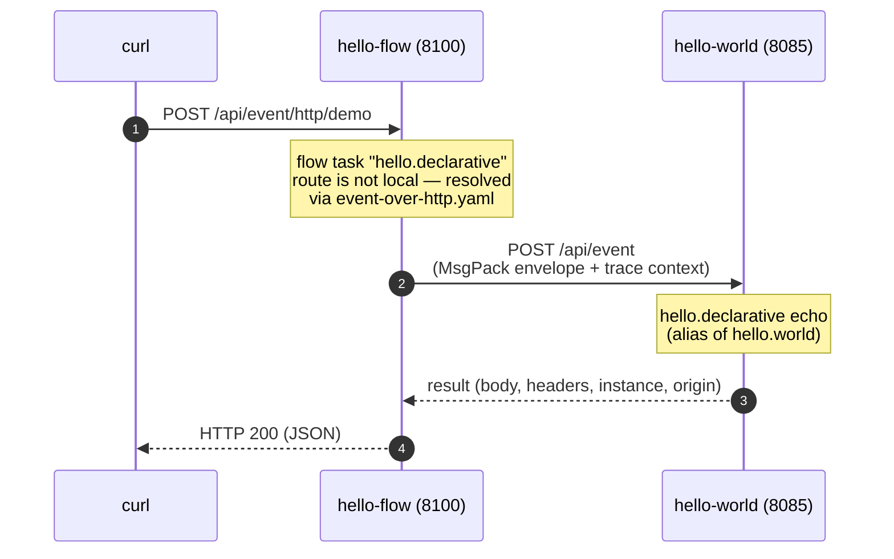

# Event over HTTP

**Event over HTTP** lets a function in one application instance call a function in
*another* instance — the same route-name + `EventEnvelope` contract you use locally,
carried across the network. It is the only cross-instance coupling in the platform, and it
is **opt-in by design**: an instance is a closed world unless a developer deliberately
publishes a function to it.

Everything on this page describes this repository's engine
(`crates/platform-core/src/automation/event_api.rs`); the wire format is shared verbatim
with the Java engine (see [EventEnvelope wire format](event-envelope-reference.md)), so a
Rust instance and a Java instance interoperate without adaptation.

## The encapsulation boundary

Every function is reachable **inside** its instance — by REST automation, flows, and
graphs — but nothing crosses the instance boundary unless you expose it:

```rust
// private (the default) — in-instance only, exactly like Java @PreLoad
#[preload(route = "v1.internal.worker")]
struct InternalWorker;

// public — callable from another instance over /api/event
#[preload(route = "v1.public.api", is_private = false)]
struct PublicApi;
```

The programmatic pair is `platform.register_private(...)` (private) versus plain
`platform.register(...)` (public). Private is the default for `#[preload]` — the same
posture as Java `@PreLoad`, whose `isPrivate` defaults to `true`. A remote call to a
private function is rejected with **403**; engine internals (the actuators, the telemetry
sink, the no-op function, the async HTTP client, the event service itself) are all private,
so they can never be reached from outside.

## The endpoint

`POST /api/event` ships in the default `rest.yaml` — every application with
`rest.automation: true` exposes it with no configuration (your own `rest.yaml` entry for
that URL wins if you want to change its timeout, attach authentication, or add CORS).

| Request element | Meaning |
|---|---|
| Body | the serialized request `EventEnvelope` (standard wire format), `content-type: application/octet-stream` |
| `x-ttl` header | RPC timeout in milliseconds (minimum 1000) |
| `x-async: true` header | drop-n-forget: deliver and acknowledge, do not wait for a reply |

The service decodes the envelope, checks its `to` route, and dispatches:

| Outcome | Response |
|---|---|
| RPC to a public route | HTTP 200; body = the target's reply envelope (its own status inside) |
| Async to a public route | HTTP 200; body = a 202 acknowledgement envelope (`type: async, delivered: true`) |
| `to` missing | HTTP 400, "Missing routing path" |
| Route not found | HTTP 404, "Route {to} not found" |
| Route is private | HTTP 403, "{to} is private" |
| RPC timeout | HTTP 408 with the error message |

In every case the HTTP response body is itself a serialized envelope, so the caller reads
the outcome the same way regardless of success or failure.

## Calling another instance

The `event_over_http` client posts a serialized envelope to a peer and returns the reply
envelope (or, for an async call, the 202 acknowledgement):

```rust
use platform_core::automation::event_over_http;
use std::time::Duration;

let reply = event_over_http(
    &po,
    "http://peer-host:8100/api/event",
    EventEnvelope::new()
        .set_to("v1.public.api")
        .set_body(request_payload)?,
    Duration::from_secs(5),
    true, // rpc = true; false for drop-n-forget
).await?;
```

Trace context propagates automatically: the client sets `x-trace-id` and the W3C
`traceparent` header from the envelope's trace, so a trace started in one instance
continues in the other and the remote function's spans parent onto the caller's span — a
single distributed trace across the boundary (and across languages).

!!! note "Port note"
    The v1 service accepts the **standard** wire format only. A legacy Java *compact* envelope
    (single-character keys) is rejected with a clear 400; Java 4.10+ defaults to standard, so
    this only surfaces with an old or misconfigured peer. The Java engine's per-format response
    mirroring is therefore unnecessary here — replies are always standard.

## Event over HTTP by configuration

Calling the API is rarely necessary: the same forwarding can be **declared**, so that user
code needs zero HTTP awareness — this service abstraction means an application does not
know (or care) where its target services run. Name the routing map in your application
configuration (this is also the default, so a `resources/event-over-http.yaml` file is
picked up with no configuration at all):

```yaml
yaml.event.over.http: 'classpath:/event-over-http.yaml'
```

and list the remote routes in that file:

```yaml
event.http:
  - route: 'hello.world'
    target: 'http://127.0.0.1:8085/api/event'
  - route: 'event.save.get'
    target: 'http://127.0.0.1:${server.port}/api/event'
    # optional security headers
    headers:
      authorization: 'demo'
```

From then on, **every `PostOffice` call to a listed route crosses to the peer
transparently** — the calling function cannot tell a remote route from a local one:

- `po.request(event, timeout)` forwards as an Event-over-HTTP RPC and returns the peer's
  reply envelope directly.
- `po.send(event)` with a `reply_to` runs the **callback dance**: the reply address is
  withheld from the wire, the forward runs as RPC, and the peer's response is delivered to
  the original `reply_to` locally — with the sender route, trace context, and business
  correlation-id restored.
- `po.send(event)` without a `reply_to` is forwarded **drop-n-forget**, expecting the
  peer's 202 acknowledgement (a failure is logged, never raised).

The optional per-target `headers` ride on every forwarded HTTP call — the place for an
`authorization` credential when the peer's `/api/event` endpoint sits behind
authentication. `${...}` references (environment variables, base configuration keys such
as `server.port` above) resolve when the file loads. An absent file simply leaves the
feature off.

A forwarded envelope carries the `x-event-api` marker header, and an event bearing it is
never forwarded again — the recursion guard that lets two instances declare routes toward
each other without a loop. The receiving function sees the header like any other envelope
header.

!!! note "Port note"
    Same semantics as the Java engine's `yaml.event.over.http`
    (`EventEmitter.sendWithEventHttp` and the request-path hooks), including the fixed
    60-second forward timeout on the send path — an RPC made with `po.request` uses the
    caller's own timeout. The Java engine loads the map at startup inside its
    `EventEmitter` singleton; this port has no such singleton, so the map loads once on
    first use — same configuration, same behavior.

## Zero-code demo: hello-flow to hello-world

The two example applications ship with a working declarative demo. The `hello-flow`
example (port 8100) has a REST endpoint wired to an Event Script flow whose only task is
the route `hello.declarative` — a route that does **not** exist in hello-flow. The
`event-over-http.yaml` configuration tells the system where that route lives, and the
platform makes the Event-over-HTTP call automatically. There is no orchestration or HTTP
client code anywhere: the caller side is a flow definition plus two configuration entries,
and the callee side is an ordinary public function.



The moving parts:

**Callee — hello-world (port 8085).** The `HelloWorld` echo function is public and
registers two route names (a comma-separated alias list); the second exists for this demo:

```rust
#[preload(
    route = "hello.world, hello.declarative",
    instances = 10,
    is_private = false
)]
struct HelloWorld;
```

**Caller — hello-flow (port 8100).** In `application.yml`, the declarative routing file is
named and the peer address is externalized:

```yaml
yaml.event.over.http: 'classpath:/event-over-http.yaml'
peer.demo.host: '127.0.0.1'
peer.demo.port: 8085
```

`event-over-http.yaml` maps the foreign route to the peer's Event API endpoint:

```yaml
event.http:
  - route: 'hello.declarative'
    target: 'http://${peer.demo.host:127.0.0.1}:${peer.demo.port}/api/event'
```

and the REST endpoint `GET/POST /api/event/http/demo` (see `rest.yaml`) runs the flow
`event-over-http-demo` whose task simply names the route:

```yaml
tasks:
  - name: 'event-over-http-demo'
    input:
      - 'input.header -> header'
      - 'input.body -> *'
    process: 'hello.declarative'
    output:
      - 'text(application/json) -> output.header.content-type'
      - 'result -> output.body'
    description: 'Make an Event-over-Http call using the event-over-http.yaml configuration'
    execution: end
```

### Step by step

1. Start the callee in one terminal:

    ```shell
    cargo run -p hello-world
    ```

2. Start the caller in a second terminal:

    ```shell
    cargo run -p hello-flow
    ```

3. Hit the demo endpoint:

    ```shell
    curl -s -X POST -H "content-type: application/json" \
         -d '{"hello": "world"}' http://127.0.0.1:8100/api/event/http/demo
    ```

4. The hello-world echo replies through the same path in reverse — the response arrives as
   regular JSON:

    ```json
    {
      "body": { "hello": "world" },
      "headers": {
        "x-event-api": "callback",
        "x-flow-id": "event-over-http-demo",
        "...": "..."
      },
      "instance": 4,
      "origin": "5a309e1934c64ba0a7502062ec4dc393"
    }
    ```

    The `origin` identifies the application instance that actually executed the function —
    the hello-world app, not the app you called. The `x-event-api` header is the
    recursion-guard marker stamped on the forwarded envelope; its presence tells you the
    event crossed the wire declaratively.

5. Look at both applications' logs: the trace context propagated across the HTTP hop
   automatically. Both apps log telemetry under the **same trace id**, the
   `hello.declarative` RPC record carries `span_id` and `parent_span_id` chaining it onto
   the caller's flow, and — with the default-on
   [application log context](observability.md#the-application-log-context) — every
   structured log line on both sides is stamped with that trace id.

### The programmatic twin

The hello-flow example has a second endpoint, `/api/event/http/programmatic`, that reaches
the **same peer function** through the programmatic pattern. Its flow task
(`v1.event.over.http.rpc` in `examples/hello-flow/src/main.rs`) builds the peer's Event
API endpoint URL from the same `peer.demo.host` / `peer.demo.port` properties and passes
it directly to the request API — so `hello.world` needs **no entry** in
`event-over-http.yaml`:

```rust
let endpoint = format!("http://{host}:{port}/api/event");
let request = EventEnvelope::new().set_to("hello.world").set_raw_body(input.body().clone());
let response = event_over_http(&po, &endpoint, request, Duration::from_secs(10), true).await?;
```

```shell
curl -s -X POST -H "content-type: application/json" \
     -d '{"hello": "world"}' http://127.0.0.1:8100/api/event/http/programmatic
```

The response has the same echo shape, and the trace continues across the hop the same way.
This is why the echo function registers **two route names**: the programmatic endpoint
calls the primary route `hello.world`, the declarative endpoint calls the alias
`hello.declarative`. Choose declarative when the target address is deployment
configuration (the usual case); choose programmatic when the code must compute or vary
the target at runtime.

!!! note "Port note"
    Against the **Java** callee (lambda-example), the echoed headers also include Java's
    worker-injected `my_route` header — `hello.world` for the programmatic call,
    `hello.declarative` for the declarative one — directly naming the route that served
    it. The Rust worker does not inject `my_route`; with the Rust callee, tell the
    patterns apart by the endpoint you called or by the declarative marker
    `x-event-api: callback` in the echoed headers.

### Same demo, different language

The canonical [Java implementation](https://github.com/Accenture/mercury-composable)
ships counterpart examples: **lambda-example** is the parallel of hello-world (same port
8085, same public `hello.world` / `hello.declarative` echo), and **composable-example**
is the parallel of hello-flow (same port 8100, same two demo endpoints). That makes the
demo above a cross-language demo with **zero changes**:

1. Stop the Rust hello-world.
2. Build and start the Java lambda-example from a clone of the Java repository
   (`x.y.z` is the current version in its root `pom.xml`):

    ```shell
    cd examples/lambda-example
    mvn clean package
    java -jar target/lambda-example-x.y.z.jar
    ```

3. Run the same `curl` commands again — both demo endpoints now call Java.

The response has the same shape — only the `origin` now identifies the Java application.
The hello-flow example neither knows nor cares which language serves the route: it
addresses a route name, the envelope travels in the language-neutral
[standard wire format](event-envelope-reference.md), and the trace context continues
across the language boundary.

The mirror direction works the same way: the Java composable-example (port 8100) declares
`hello.declarative` in its own `event-over-http.yaml` and can call the Rust hello-world —
or the Java lambda-example — interchangeably. Point `peer.demo.host` / `peer.demo.port`
at any peer that exposes the routes.

The full cross-language matrix — both directions, both patterns, RPC and async, error
semantics and trace continuity — was exercised by live bidirectional interop drives
between the two engines; the permanent record is the
[Interop Test Report](https://accenture.github.io/mercury-composable/test-reports/event-over-http-interop/)
on the Java docs site.
