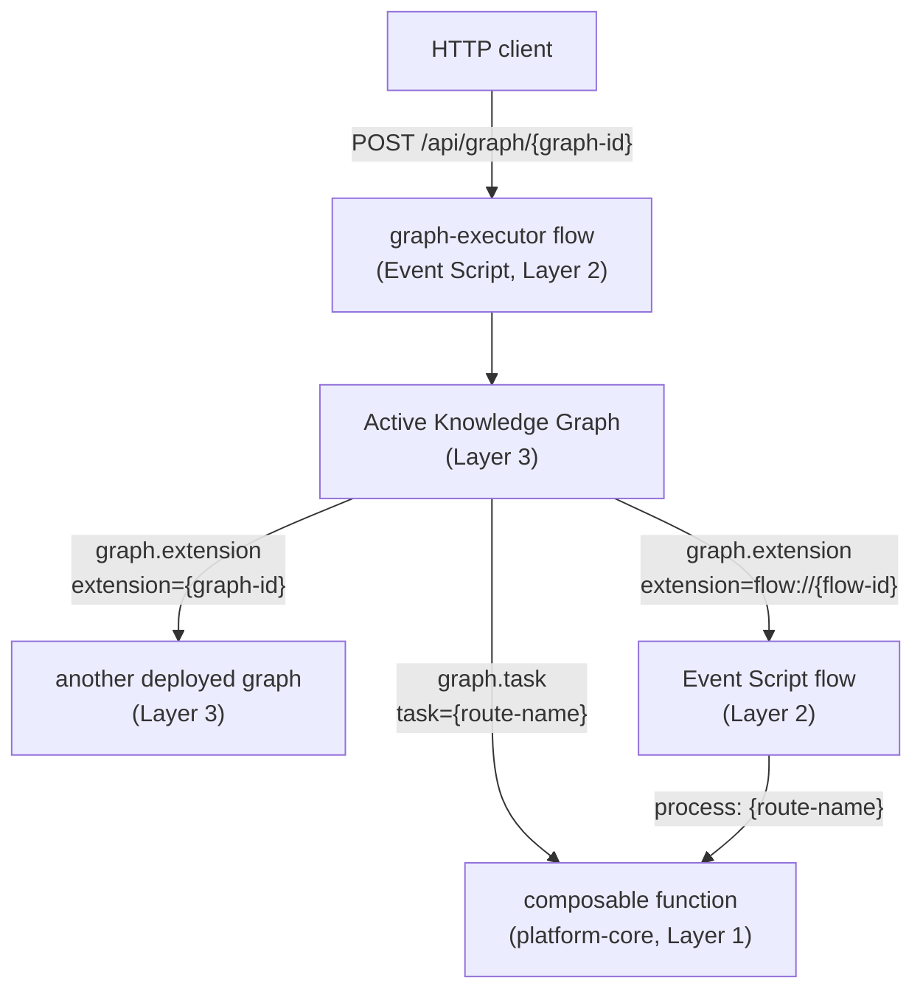

# Composing the Layers

An active knowledge graph is the top of the platform's ascent — and it **composes the layers
beneath it without coupling**. Every seam in this page is a *name*: a graph id, a flow id, a
function's route name, a provider node's alias. Nothing holds a reference to anything; each
layer delegates downward by name, over events, which is the same
[defining invariant](../event-driven/index.md) the whole platform rests on.



## Delegating to a sub-graph

[`graph.extension`](skills-reference.md#extension) lets a graph call another **deployed
graph** as a reusable module — the composition pattern for building larger capabilities from
smaller, certified graphs:

```
create node performance-evaluator
with type Extension
with properties
skill=graph.extension
extension=evaluate-sales-performance
input[]=input.body.department_id -> id
output[]=result.sales_performance -> output.body.sales_performance
```

The sub-graph runs in isolation. Each `input[]` target is a bare key that becomes the
sub-graph's `input.body.{key}`; the node's `result.*` namespace *is* the sub-graph's
`output.body`, and only what you map out flows back into the caller's state. The target must
be a **deployed** model (the same ids callable at `POST /api/graph/{graph-id}`) — a session
draft is not addressable until exported and deployed. The full delegation contract is in the
[skills reference](skills-reference.md#extension).

## Delegating to an Event Script flow

The same skill bridges to the **composable layer**: prefix the target with `flow://` and the
node delegates to an [Event Script](../event-script/index.md) flow instead of a graph. This
is the pro-code escape hatch — hand demanding logic to a flow of composable functions, then
return to the graph. The contract is identical: named `input[]` keys feed the flow's
`input.body`, and `result.*` is the flow's `output.body`.

```
create node extension
with type Extension
with properties
skill=graph.extension
extension=flow://flow-11
input[]=input.body.hello -> hello
input[]=input.body.message -> message
output[]=result -> output.body
```

The flow on the other side of the bridge is ordinary Layer-2 configuration — this one ships
with the engine (`crates/knowledge-graph/resources/flows/flow-11.yml`, the tutorial-11
target):

```yaml
flow:
  id: 'flow-11'
  description: 'This event flow will echo all input parameters for Tutorial 11'
  ttl: 60s
  exception: 'simple.exception.handler'

first.task: 'no.op'

tasks:
  - input:
      - 'input.body -> *'
    process: 'no.op'
    output:
      - 'result -> output.body'
    description: 'echo everything in the input payload'
    execution: end
```

A graph calls a flow; the flow calls composable functions; nobody imports anybody. Authoring
the flow side: the [flow grammar](../event-script/flow-grammar.md) and
[Event Script syntax](../event-script/syntax.md).

## Invoking a composable function

[`graph.task`](skills-reference.md#task) is the **custom-logic seam**: it invokes a single
composable function through its route name, making your own Rust function, in effect, a
custom skill. This is the lightweight option when a full flow would be overkill:

```
create node hello-task
with type Task
with properties
skill=graph.task
task=v1.hello.task
input[]=input.body -> *
output[]=result -> output.body
```

`v1.hello.task` is a shipped demo function; the `*` target merges the mapped value into the
function's request body, and `result` is the function's whole result (property semantics:
[skills reference](skills-reference.md#task)). The function itself is an ordinary Layer-1
citizen — a `#[preload]`-registered `ComposableFunction` that knows nothing about graphs —
so anything already registered on the event bus is one `graph.task` node away from the
semantic layer. Writing one:
[Write your first function](../event-driven/write-your-first-function.md).

## Reaching external systems

Outward composition is declarative too. [`graph.api.fetcher`](skills-reference.md#api-fetcher)
never holds a URL: it names **Dictionary** nodes (the data attributes it wants), and each
Dictionary names the **Provider** node that defines the endpoint — URL (with `{name}` path
placeholders filled from the inputs), method, and request/response mappings. Several
dictionaries can share one provider, and identical calls are deduplicated into a single HTTP
request. The complete authoring rules — the Provider's `input[]` request mappings, the
Dictionary's bare parameter declarations and `response.* -> result.*` output mappings — are
specified once, in
[Provider & Dictionary — the data-dictionary method](command-reference.md#provider-dictionary);
the shipped *tutorial 3* is the clean end-to-end example.

Because Dictionary and Provider nodes are configuration referenced by name — never traversed
— they are wired into the graph's [island knowledge layer](command-reference.md#island), so
the model also *documents* the data sources it depends on: no node left unconnected.

## Discovery makes delegation self-service

How do you know what `extension=` targets exist? Ask the engine. Two read-only commands
enumerate the composable assets on the server, each with its purpose or description — so
neither a human nor an AI agent needs an out-of-band brief to compose:

```
> list flows
Event Script flows - extension=flow://{flow-id} targets:
flow-11 - This event flow will echo all input parameters for Tutorial 11
graph-executor - MiniGraph Traveler
Total 2 flows
```

`list graphs` does the same for deployed graph models, listing each root node's `purpose` —
the graph inventory reads as living documentation
([discovery commands](command-reference.md#describe)).

!!! note "Discovery in both engines"
    The discovery commands originated in this Rust port and were contributed upstream — the
    Java engine has them too
    ([mercury-composable#199](https://github.com/Accenture/mercury-composable/pull/199)).

## Exposing a graph: the graph-executor flow {#exposure}

Composition also runs *upward*. A deployed graph is not invoked directly — an Event Script
flow wraps it, which is how it gets a REST endpoint while keeping execution decoupled from
protocol. Both halves ship with the engine. The endpoint binding in `rest.yaml`:

```yaml
- service: 'http.flow.adapter'
  methods: ['POST', 'GET']
  url: '/api/graph/{graph_id}'
  flow: 'graph-executor'
  timeout: 30s
  tracing: true
```

And the wrapper flow (`graph-executor.yml`) runs the engine as an ordinary flow task:

```yaml
flow:
  id: 'graph-executor'
  description: 'MiniGraph Traveler'
  ttl: 60s
  exception: 'graph.exception.handler'

first.task: 'graph.executor'

tasks:
  - input:
      - 'model.instance -> header.instance'
      - 'input.path_parameter.graph_id -> header.graph'
    process: 'graph.executor'
    output:
      - 'status -> output.status'
      - 'header -> output.header'
      - 'result -> output.body'
    description: 'Perform active graph traversal and execute nodes'
    execution: end
```

So a request flows `http.flow.adapter` → `graph-executor` flow → `graph.executor` (loads the
model by `graph_id`, traverses it) → HTTP response:

```bash
curl -X POST http://127.0.0.1:8100/api/graph/tutorial-1
```

```
hello world
```

Because the protocol lives in the flow, the *same* graph could later be driven by a different
adapter with no change to the model — protocol stays decoupled from execution, all the way
up.

## See also

- [Built-in skills reference](skills-reference.md) — `graph.extension`, `graph.task`, and
  `graph.api.fetcher` in full.
- [MiniGraph command grammar](command-reference.md) —
  [Provider & Dictionary authoring](command-reference.md#provider-dictionary), the
  [island convention](command-reference.md#island), and the
  [discovery commands](command-reference.md#describe).
- [Composable Orchestration](../event-script/index.md) — the flow layer on the other side of
  `flow://`.
- [Knowledge Graph as Application](index.md) — the layer model this page realizes.

---

*Adapted from the mercury-composable guide `knowledge-graph/composing-the-layers.md`; behavior verified against this repository's engine-verified AI documentation.*
