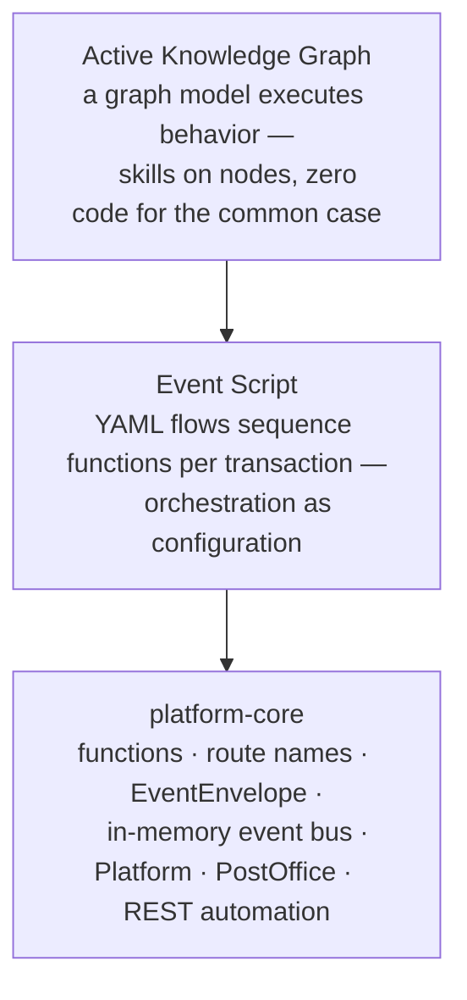

# mercury

**A Rust port of [mercury-composable](https://github.com/Accenture/mercury-composable) —
Accenture's event-driven, composable application platform — delivered bottom-up:
foundation → user interface.**

Self-contained **functions** (actors) addressed only by **route name** exchange immutable
**`EventEnvelope`** messages over an **in-memory event bus**. Orchestration is configuration,
not code. At the top, an **active knowledge graph** *is* the application.

## The three layers

- **platform-core** — the event-driven foundation. Stateless functions registered by
  dot-separated route names, N worker instances each, RPC and fire-and-forget messaging,
  configuration management, structured logging, distributed tracing, and a declarative HTTP
  boundary where **`rest.yaml` *is* the router**.

- **Event Script** — composable orchestration. A YAML DSL sequences functions for a
  transaction with a per-transaction state machine, `input`/`output` data mapping, and
  execution types — the flow configuration is identical to the Java original, so flows port
  unchanged.

- **Active knowledge graph** — the semantic layer. A graph model executes behavior through
  skills embedded on nodes during traversal, with a live **Playground** (port 8100) where
  humans and AI agents co-author graphs in real time.

## Why a Rust port

The same destination as mercury-composable (Java), re-reached in Rust: **AI-assisted Semantic
Application Development**, on a lightweight, fast foundation
(the ported event bus benchmarks at ~155K RPC ops/s at 6 µs round-trip). The port is
**faithful by design** — the Java project remains the canonical behavior specification
(*map, don't mirror*) — with deliberate, documented divergences where the platform differs
(tokio instead of virtual threads, compile-time registration instead of classpath scanning,
no Kafka service mesh, no Spring).

## Where to go next

- **[Getting Started](guides/getting-started.md)** — build the workspace and run the examples.
- **AI agents** start at [`docs/llms.txt`](llms.txt) — the machine-readable map of the
  agent-optimized documentation set (engine-verified; a fresh agent can build graphs from it
  with zero out-of-band context).
- **[Architecture Decisions](arch-decisions/ADR.md)** — the durable design record.

!!! note "Rust port"
    Throughout this site, boxes like this mark the places where the Rust port deliberately
    differs from the Java original — no silent divergence.
