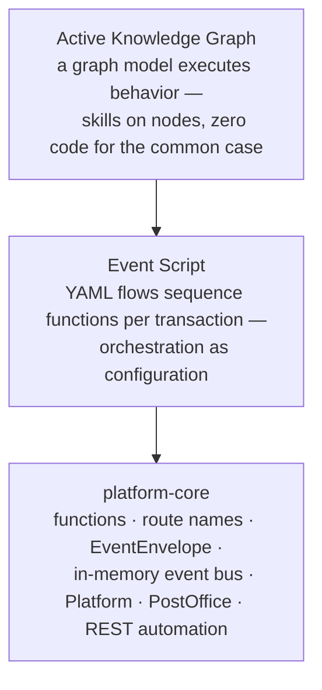

# mercury

**A Rust port of [mercury-composable](https://github.com/Accenture/mercury-composable) —
Accenture's event-driven, composable application platform — delivered bottom-up:
foundation → user interface.**

Self-contained **functions** (actors) addressed only by **route name** exchange immutable
**`EventEnvelope`** messages over an **in-memory event bus**. Orchestration is configuration,
not code. At the top, an **active knowledge graph** *is* the application.

## The three layers

```mermaid
flowchart TB
    KG["Active Knowledge Graph<br/>a graph model executes behavior —
    skills on nodes, zero code for the common case"]
    ES["Event Script<br/>YAML flows sequence functions per transaction —
    orchestration as configuration"]
    PC["platform-core<br/>functions · route names · EventEnvelope ·
    in-memory event bus · Platform · PostOffice · REST automation"]
    KG --> ES --> PC
```

- **platform-core** — the event-driven foundation. Stateless functions registered by
  dot-separated route names, N worker instances each, RPC and fire-and-forget messaging,
  configuration management, structured logging, distributed tracing, and a declarative HTTP
  boundary where **`rest.yaml` *is* the router**.

- **Event Script** — composable orchestration. A YAML DSL sequences functions for a
  transaction with a per-transaction state machine, `input`/`output` data mapping, and
  execution types — the flow configuration is identical to the Java original, so flows port
  unchanged.

- **Active knowledge graph** — the semantic layer. A graph model executes behavior through
  skills embedded on nodes during traversal, with a live **Playground** (port 8085) where
  humans and AI agents co-author graphs in real time.

## Why a Rust port

The same destination as mercury-composable (Java), re-reached in Rust: **AI-assisted Semantic
Application Development**, on a lightweight, fast foundation
(the ported event bus benchmarks at ~155K RPC ops/s at 6 µs round-trip). The port is
**faithful by design** — the Java project remains the canonical behavior specification
(*map, don't mirror*) — with deliberate, documented divergences where the platform differs
(tokio instead of virtual threads, compile-time registration instead of classpath scanning,
no Kafka service mesh, no Spring).

## Explore the docs

- **Get started** — [Getting Started](guides/getting-started.md)
- **Guides** — [Event-driven Functions](guides/event-driven/index.md) ·
  [Event Script Flows](guides/event-script/index.md) ·
  [REST Automation](guides/rest-automation.md) · [Event over HTTP](guides/event-over-http.md) ·
  [Observability](guides/observability.md)
- **Knowledge Graph** — [Knowledge Graph as Application](guides/knowledge-graph/index.md) ·
  [Build Your First Graph](guides/knowledge-graph/build-your-first-graph.md) ·
  [Workflow Suspension](guides/knowledge-graph/workflow-suspension.md) ·
  [Playground & AI Companion](guides/knowledge-graph/playground-and-companion.md)
- **Concepts** — [Methodology](guides/methodology.md) · [Architecture Overview](guides/architecture.md) ·
  [Port Scope & Fidelity](background/port-scope.md) ·
  [Architecture Decision Records](arch-decisions/ADR.md)
- **Reference** — [Macros](guides/macros-reference.md) ·
  [Configuration](guides/configuration-reference.md) · [Event Envelope](guides/event-envelope-reference.md) ·
  [Flow Schema](guides/flow-schema-reference.md) · [API Overview](guides/api-overview.md)
- **AI agents** start at [`docs/llms.txt`](llms.txt) — the machine-readable map of the
  agent-optimized documentation set (engine-verified; a fresh agent can build graphs from it
  with zero out-of-band context). Every layer section carries its own AI agent guide.

## Project

- **Source:** [github.com/Accenture/mercury](https://github.com/Accenture/mercury)
- **Release notes:** [CHANGELOG](https://github.com/Accenture/mercury/blob/main/CHANGELOG.md)
- **Contributing:** [CONTRIBUTING](https://github.com/Accenture/mercury/blob/main/CONTRIBUTING.md)
  · [Code of Conduct](https://github.com/Accenture/mercury/blob/main/CODE_OF_CONDUCT.md)
- **Java version:** Mercury's canonical Java implementation — same three layers, same flow
  YAML, behavior-synced with this engine:
  [github.com/Accenture/mercury-composable](https://github.com/Accenture/mercury-composable)
  · [documentation](https://accenture.github.io/mercury-composable/)

!!! note "Rust port"
    Throughout this site, boxes like this mark the places where the Rust port deliberately
    differs from the Java original — no silent divergence.
