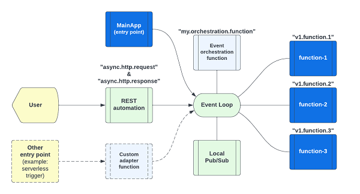

# Introduction

Mercury version 3 is a toolkit for writing composable applications.

At the platform level, composable architecture refers to loosely coupled platform services, utilities, and
business applications. With modular design, you can assemble platform components and applications to create
new use cases or to adjust for ever-changing business environment and requirements. Domain driven design (DDD),
Command Query Responsibility Segregation (CQRS) and Microservices patterns are the popular tools that architects
use to build composable architecture. You may deploy application in container, serverless or other means.

At the application level, a composable application means that an application is assembled from modular software
components or functions that are self-contained and pluggable. You can mix-n-match functions to form new applications.
You can retire outdated functions without adverse side effect to a production system. Multiple versions of a function
can exist, and you can decide how to route user requests to different versions of a function. Applications would be
easier to design, develop, maintain, deploy, and scale.

## Composable application architecture

> Figure 1 - Composable application architecture



As shown in Figure 1, a minimalist composable application consists of three user defined components:

1. Main modules that provides an entry point to your application
2. One or more business logic modules (shown as "function-1" to "function-3" in the diagram)
3. An event orchestration module to command the business logic modules to work together as an application

and a composable event engine that provides:

1. REST automation
2. An in-memory event system (aka "event loop")
3. Local pub/sub system

### Main module

Each application has an entry point. You may implement an entry point in a main application like this:

```java
@MainApplication
public class MainApp implements EntryPoint {
   public static void main(String[] args) {
      AppStarter.main(args);
   }
   @Override
   public void start(String[] args) {
        // your startup logic here
      log.info("Started");
   }
}
```

For a command line use case, your main application ("MainApp") module would get command line arguments and
send the request as an event to a business logic function for processing.

For a backend application, the MainApp is usually used to do some "initialization" or setup steps for your
services.

### Business logic modules

Your user function module may look like this:

```java
@PreLoad(route = "hello.simple", instances = 10)
public class SimpleDemoEndpoint implements TypedLambdaFunction<AsyncHttpRequest, Object> {
    @Override
    public Object handleEvent(Map<String, String> headers, AsyncHttpRequest input, int instance) {
        // business logic here
        return result;
    }
}
```

Each function in a composable application should be implemented in the first principle of "input-process-output".
It should be stateless and self-contained. i.e. it has no direct dependencies with any other functions in the
composable application. Each function is addressable by a unique "route name" and you can use PoJo for input and output.

In the above example, the function is called "hello.simple". The input is an AsyncHttpRequest object, meaning that
this function is a "Backend for Frontend (BFF)" module that is invoked by a REST endpoint.

When a function finishes processing, its output will be delivered to the next function.

> Writing code in the first principle of "input-process-output" promotes Test Driven Development (TDD) because
  interface contact is clearly defined. Self-containment means code is more readable too.

### Event orchestration

A transaction can pass through one or more user functions. In this case, you can write a user function to receive
request from a user, make requests to some user functions, and consolidate the responses before responding to the
user.

Note that event orchestration is optional. In the most basic REST application, the REST automation system can send
the user request to a function directly. When the function finishes processing, its output will be routed as
a HTTP response to the user.

### The Composable engine

Event routing is done behind the curtain by the composable engine which consists of the REST automation service,
an in-memory event system ("event loop") and an optional localized pub/sub system.

### REST automation

REST automation creates REST endpoints by configuration rather than code. You can define a REST endpoint like this:

```yaml
  - service: "hello.world"
    methods: ['GET']
    url: "/api/hello/world"
    timeout: 10s
```

In this example, when a HTTP request is received at the URL path "/api/hello/world", the REST automation system
will convert the HTTP request into an event for onward delivery to the user defined function "hello.world". 
Your function will receive the HTTP request as input and return a result set that will be sent as a HTTP response
to the user.

For more sophisticated business logic, you can write a function to receive the HTTP request and do 
"event orchestration". i.e. you can do data transformation and send "events" to other user functions to
process the request.

### In-memory event system

The composable engine encapsulates the Eclipse vertx event bus library for event routing. It exposes the 
"PostOffice" API for your orchestration function to send async or RPC events.

### Local pub/sub system

The in-memory event system is designed for point-to-point delivery. In some use cases, you may like to have
a broadcast channel so that more than one function can receive the same event. For example, sending notification
events to multiple functions. The optional local pub/sub system provides this multicast capability.

### Other user facing channels

While REST is the most popular user facing interface, there are other communication means such as event triggers
in a serverless environment. You can write a function to listen to these external event triggers and send the events
to your user defined functions. This custom "adapter" pattern is illustrated as the dotted line path in Figure 1.

## Build the platform libraries

The first step is to build Mercury libraries from source.
To simplify the process, you may publish the libraries to your enterprise artifactory.

```shell
mkdir sandbox
cd sandox
git clone https://github.com/Accenture/mercury.git
cd mercury
mvn clean install
```

The above sample script clones the Mercury open sources project and builds the libraries from source.

The pre-requisite is maven 3.8.6 and openjdk 1.8 or higher. We have tested mercury with Java version 1.8 to 19.

This will build the mercury libraries and the sample applications.

The `platform-core` project is the foundation library for writing composable application.

## Run the lambda-example application

Assuming you follow the suggested project directory above, you can run a sample composable application
called "lambda-example" like this:

```shell
cd sandbox/mercury/examples/lambda-example
java -jar target/lambda-example-3.0.6.jar
```

You will find the following console output when the app starts

```text
Exact API paths [/api/event, /api/hello/download, /api/hello/upload, /api/hello/world]
Wildcard API paths [/api/hello/download/{filename}, /api/hello/generic/{id}]
```

Application parameters are defined in the resources/application.properties file (or application.yml if you prefer).
When `rest.automation=true` is defined, the system will parse the "rest.yaml" configuration for REST endpoints.

## Light-weight non-blocking HTTP server

When REST automation is turned on, the system will start a lightweight non-blocking HTTP server.
By default, it will search for the "rest.yaml" file from "/tmp/config/rest.yaml" and then from "classpath:/rest.yaml".
Classpath refers to configuration files under the "resources" folder in your source code project.

To instruct the system to load from a specific path. You can add the `rest.automation.yaml` parameter.

To select another server port, change the `rest.server.port` parameter.

```properties
rest.server.port=8085
rest.automation=true
rest.automation.yaml=classpath:/rest.yaml
```

To create a REST endpoint, you can add an entry in the "rest" section of the "rest.yaml" config file like this:

```yaml
  - service: "hello.download"
    methods: [ 'GET' ]
    url: "/api/hello/download"
    timeout: 20s
    cors: cors_1
    headers: header_1
    tracing: true
```

The above example creates the "/api/hello/download" endpoint to route requests to the "hello.download" function.
We will elaborate more about REST automation in [Chapter-3](CHAPTER-3.md).

## Function is an event handler

A function is executed when an event arrives. You can define a "route name" for each function.
It is created by a class implementing one of the following interfaces:

1. `TypedLambdaFunction` allows you to use PoJo or HashMap as input and output
2. `LambdaFunction` is untyped, but it will transport PoJo from the caller to the input of your function
3. `KotlinLambdaFunction` is a typed lambda function using Kotlin suspend function

## Execute the "hello.world" function

With the application started in a command terminal, please use a browser to point to:
http://127.0.0.1:8085/api/hello/world

It will echo the HTTP headers from the browser like this:

```json
{
  "headers": {},
  "instance": 1,
  "origin": "20230324b709495174a649f1b36d401f43167ba9",
  "body": {
    "headers": {
      "sec-fetch-mode": "navigate",
      "sec-fetch-site": "none",
      "sec-ch-ua-mobile": "?0",
      "accept-language": "en-US,en;q=0.9",
      "sec-ch-ua-platform": "\"Windows\"",
      "upgrade-insecure-requests": "1",
      "sec-fetch-user": "?1",
      "accept": "text/html,application/xhtml+xml,application/xml,*/*",
      "sec-fetch-dest": "document",
      "user-agent": "Mozilla/5.0 Chrome/111.0.0.0"
    },
    "method": "GET",
    "ip": "127.0.0.1",
    "https": false,
    "url": "/api/hello/world",
    "timeout": 10
  }
}
```

### Where is the "hello.world" function?

The function is defined in the MainApp class in the source project with the following segment of code:

```java
LambdaFunction echo = (headers, input, instance) -> {
    log.info("echo #{} got a request", instance);
    Map<String, Object> result = new HashMap<>();
    result.put("headers", headers);
    result.put("body", input);
    result.put("instance", instance);
    result.put("origin", platform.getOrigin());
    return result;
};
// Register the above inline lambda function
platform.register("hello.world", echo, 10);
```

The Hello World function is written as an "inline lambda function". It is registered programmatically using
the `platform.register` API.

The rest of the functions are written using regular classes implementing the LambdaFunction, TypedLambdaFunction
and KotlinLambdaFunction interfaces.

## TypedLambdaFunction

Let's examine the `SimpleDemoEndpoint` example under the "services" folder. It may look like this:

```java
@CoroutineRunner
@PreLoad(route = "hello.simple", instances = 10)
public class SimpleDemoEndpoint implements TypedLambdaFunction<AsyncHttpRequest, Object> {
    @Override
    public Object handleEvent(Map<String, String> headers, AsyncHttpRequest input, int instance) {
        // business logic here
    }
}
```

The `PreLoad` annotation assigns a route name to the Java class and registers it with an in-memory event system.
The `instances` parameter tells the system to create a number of workers to serve concurrent requests.

> Note that you don't need a lot of workers to handle a larger number of users
  and requests provided that your function can finish execution very quickly.

The `CoroutineRunner` annotation advises the system to run the function as a "coroutine".
There are three function execution strategies (Kernel thread pool, coroutine and suspend function).
We will explain the concept in [Chapter-2](CHAPTER-2.md)

In a composable application, a function is designed using the first principle of "input-process-output".

In the "hello.simple" function, the input is an HTTP request expressed as a class of `AsyncHttpRequest`.
You can ignore `headers` input argument for the moment. We will cover it later.

The output is declared as "Object" so that the function can return any data structure using a HashMap or PoJo.

You may want to review the REST endpoint `/api/simple/{task}/*` in the rest.yaml config file to see how it is
connected to the "hello.simple" function.

We take a minimalist approach for the rest.yaml syntax. The parser will detect any syntax errors. Please check
application log to ensure all REST endpoint entries in rest.yaml file are valid.

## Write your first function

Using the lambda-example as a template, let's create your first function by adding a function in the 
"services" package folder. You will give it the route name "my.first.function" in the "PreLoad" annotation.

> Note that route name must use lower case letters and numbers separated by the period character.

```java

@PreLoad(route = "my.first.function", instances = 10)
public class MyFirstFunction implements TypedLambdaFunction<AsyncHttpRequest, Object> {

    @Override
    public Object handleEvent(Map<String, String> headers, AsyncHttpRequest input, int instance) {
        // your business logic here
        return input;
    }
}
```

To connect this function with a REST endpoint, you can declare a new REST endpoint in the rest.yaml like this:

```yaml
  - service: "my.first.function"
    methods: [ 'GET' ]
    url: "/api/hello/my/function"
    timeout: 20s
    cors: cors_1
    headers: header_1
    tracing: true
```

If you do not put any business logic, the above function will echo the incoming HTTP request object back to the
browser.

Now you can examine the input HTTP request object and perform some data transformation before returning a result.

The AsyncHttpRequest class allows you to access data structure such as HTTP method, URL, path parameters,
query parameters, cookies, etc.

When you click the "rebuild" button in IDE and run the "MainApp", the new function will be available in the 
application. Alternatively, you can also do `mvn clean package` to generate a new executable JAR and run the 
JAR from command line.

To test your new function, visit http://127.0.0.1:8085/api/hello/my/function

## Event driven design

Your function automatically uses an in-memory event bus. The HTTP request from the browser is converted to
an event by the system for delivery to your function as the "input" argument.

The underlying HTTP server is asynchronous and non-blocking.
i.e. it does not consume CPU resources while waiting for a response.

This composable architecture allows you to design and implement applications so that you have precise control of
performance and throughput. Performance tuning is much easier.

## Deploy your new application

You can assemble related functions in a single composable application, and it can be compiled and built into
a single "executable" for deployment using `mvn clean package`.

The executable JAR is in the target folder. 

Composable application is by definition cloud native. It is designed to be deployable using Kubernetes or serverless.

A sample Dockerfile for your executable JAR may look like this:

```shell
FROM adoptopenjdk/openjdk11:jre-11.0.11_9-alpine
EXPOSE 8083
WORKDIR /app
COPY target/your-app-name.jar .
ENTRYPOINT ["java","-jar","your-app-name.jar"]
```
<br/>

|                   Home                    |                  Chapter-2                  |
|:-----------------------------------------:|:-------------------------------------------:|
| [Table of Contents](TABLE-OF-CONTENTS.md) | [Function Execution Strategy](CHAPTER-2.md) |
